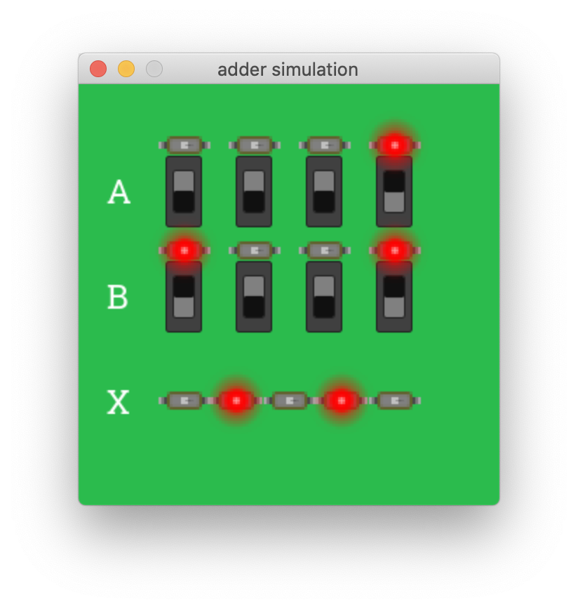

# GHDL Interactive Simulation

This is an interactive test bench for a simple VHDL adder. It uses [GHDL] to elaborate/run the simulation. It is coded in Python using the [Cocotb] library to implement the GUI test bench as a [VPI plugin] and [pygame] to render the GUI.

## Sample VHDL

```vhdl
library ieee;
  use ieee.std_logic_1164.all;
  use ieee.numeric_std.all;

entity adder is
  generic (
    DATA_WIDTH : positive := 4);
  port (
    A : in    unsigned(DATA_WIDTH-1 downto 0);
    B : in    unsigned(DATA_WIDTH-1 downto 0);
    X : out   unsigned(DATA_WIDTH downto 0));
end entity adder;

architecture rtl of adder is
begin

  add_proc : process (A, B) is
  begin
    X <= resize(A, X'length) + B;
  end process add_proc;

end architecture rtl;
```

## Resulting GUI



## Requirements
- [Python] (tested using version 3.9)
- [GHDL Simulator]
- [GNU Make] (build-essential package on *nix)

## Running
### *nix and Mac OS
- Get Python dependencies first...
```bash
pip install -r requirements.txt
```
- Then in the test directory...
```bash
make
```

### Windows
Sorry, but I need to create a docker image and instructions...

## Credits
Many thanks to the [GHDL VPI virtual board] project for the inspiration and the images (which I shamelessly borrowed given how artistically challenged I am).

[GHDL]:                   https://ghdl.github.io/ghdl/about.html
[Cocotb]:                 https://docs.cocotb.org/en/stable/
[VPI Plugin]:             https://ghdl.github.io/ghdl-cosim/vpi/index.html
[pygame]:                 https://www.pygame.org
[GHDL VPI virtual board]: https://gitlab.ensta-bretagne.fr/bollenth/ghdl-vpi-virtual-board
[GNU Make]:               https://www.gnu.org/software/make/
[GHDL Simulator]:         https://github.com/ghdl/ghdl
[Python]:                 https://www.python.org/downloads/